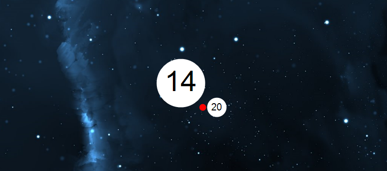

# Desktop Clock Integration (using GDI+) 

This is a project that displays a clock over your current background using GDI+

(Windows only)



Preview on my desktop

## Compile

This project is done using Visual Studio 2019, it can be compiled by opening the .sln

It is recommended using the release version if you want to run it outside Visual Studio.

## Usage

- Start the executable
- Admire your desktop clock :)
- You can stop the clock by pressing the key VK_DIVIDE ==> /

```cpp
if (GetAsyncKeyState(VK_DIVIDE) & 1)
{
    keepRunning = 0;
}
```

## Features

- Display the current time as orbiting planets
- Works with multiple monitors
- Uses double buffering
- Uses anti aliasing
- Work with multiple resolutions (you might need to change the scale in the code)

```cpp
// Constant parameters
constexpr double scaling = 1.0;
constexpr unsigned monitor_id = 0;
```

- Only one instance at a time (in release mode)

```cpp
HANDLE hHandle = CreateMutex(NULL, TRUE, L"com.arrol.desktopintegration");
if (ERROR_ALREADY_EXISTS == GetLastError())
{
    // Program already running somewhere
    return(1); // Exit program
}
```

## Issues ?

- Low framerate
- Inaccurate pixel positions
- Can't update background while running
- Always updating the whole background instead of the part that changed
```cpp
// Copy buffer to desktop
BitBlt(dc_desktop, 0, 0, containerN.right, containerN.bottom, dc_buffer, 0, 0, SRCCOPY);
```

## License
[MIT](https://choosealicense.com/licenses/mit/)